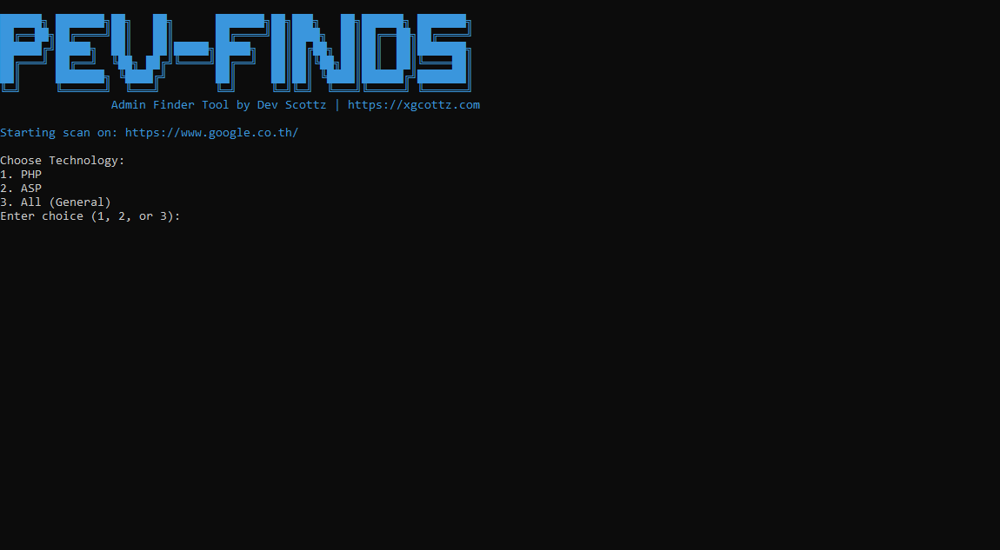

```
# Admin Finder Tool
Admin Finder Tool เป็นเครื่องมือสำหรับค้นหา Admin Panel ของเว็บไซต์ รองรับการสแกน Subdomain และเส้นทางที่ใช้บ่อยในระบบ PHP, ASP และทั่วไป
---
## ใช้ทําอะไร 
- ค้นหาเส้นทาง Admin Panel เช่น `/admin`, `/cpanel`, `/login`.
- รองรับระบบ PHP, ASP และเส้นทางทั่วไป.
- สแกน Subdomain เช่น `admin.example.com`, `cpanel.example.com`.
- มีอินเทอร์เฟซใช้งานง่าย ใช้สีช่วยแสดงผลผ่าน `Colorama`.

---


---
## **วิธีติดตั้งและใช้งาน**
### **1. ติดตั้งบน Windows**
1. **ดาวน์โหลด Git และ Python**:
   - ติดตั้ง [Git](https://git-scm.com/downloads) เพื่อใช้งานคำสั่ง `git`.
   - ติดตั้ง [Python 3.x](https://www.python.org/downloads/) และเลือกตัวเลือก **Add Python to PATH**.
2. **ดาวน์โหลดโปรเจกต์จาก GitHub**:
   เปิด Command Prompt และรันคำสั่ง:
   ```bash
   git clone https://github.com/The1975z/Admin-Finder-Tool.git
   ```
3. **ติดตั้งไลบรารีที่จำเป็น**:
   เข้าไปยังโฟลเดอร์ที่ดาวน์โหลด:
   ```bash
   cd Admin-Finder-Tool
   pip install -r requirements.txt
   ```
4. **รันโปรแกรม**:
   ใช้คำสั่งนี้เพื่อเริ่มการสแกน:
   ```bash
   python admin-finder.py https://example.com
   ```
   > เปลี่ยน `https://example.com` เป็นเว็บไซต์ที่ต้องการสแกน.
---
### **2. ติดตั้งบน Linux**
1. **ติดตั้ง Git และ Python**:
   รันคำสั่งเพื่อติดตั้ง Git และ Python:
   ```bash
   sudo apt update
   sudo apt install git python3 python3-pip -y
   ```
2. **ดาวน์โหลดโปรเจกต์จาก GitHub**:
   ใช้คำสั่งเพื่อดาวน์โหลด:
   ```bash
   git clone https://github.com/The1975z/Admin-Finder-Tool.git
   ```
3. **ติดตั้งไลบรารีที่จำเป็น**:
   เข้าไปยังโฟลเดอร์โปรเจกต์:
   ```bash
   cd Admin-Finder-Tool
   pip3 install -r requirements.txt
   ```
4. **รันโปรแกรม**:
   ใช้คำสั่งนี้เพื่อเริ่มการสแกน:
   ```bash
   python3 admin-finder.py https://example.com
   ```
   > เปลี่ยน `https://example.com` เป็นเว็บไซต์ที่ต้องการสแกน.
---

## **รายละเอียดการใช้งาน**
- เมื่อรันโปรแกรม จะมีตัวเลือกให้เลือกระบบที่ต้องการสแกน:
  - กด `1` เพื่อเลือก PHP.
  - กด `2` เพื่อเลือก ASP.
  - กด `3` เพื่อเลือกค้นหาแบบทั่วไป (All Paths).
- ผลลัพธ์ที่พบจะแสดงเส้นทาง Admin Panel บนหน้าจอ.

---

## **ตัวอย่างผลลัพธ์**
```
Scanning: https://example.com/admin/
Scanning: https://example.com/cpanel/
Scanning: https://example.com/login/

[+] พบ Admin Panels:
 - https://example.com/admin/
 - https://example.com/cpanel/
```

---
## **ข้อกำหนดเบื้องต้น**
- **Python 3.x**: ใช้สำหรับรันโปรแกรม.
- **ไลบรารี**: 
  - `requests`
  - `argparse`
  - `colorama`
  - `urllib3`

---
มีวิธีใช้งานภาษาไทยพร้อมวิธีติดตั้งสำหรับ Windows และ Linux! 🚀
